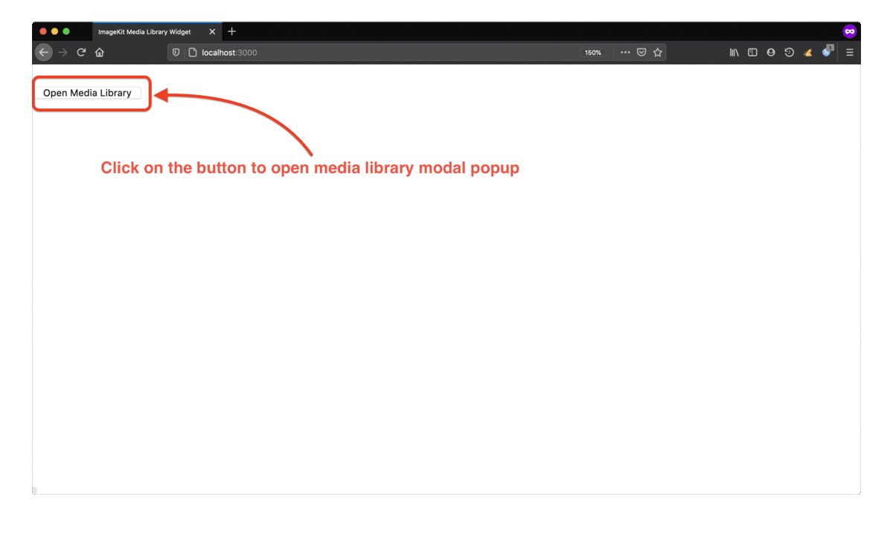

[](https://imagekit.io)

# ImageKit Media Library Widget

[](https://www.npmjs.com/package/imagekit-media-library-widget)

This plugin provides access to ImageKit Media Library through an embeddable UI from within your own CMS or website.


## Table of Contents

1. [Installation](#installation)
1. [Usage](#usage)
1. [Development](#development)
1. [Demo](#demo)
1. [CKEditor Custom Build](#ckeditor-custom-build)

---

## Installation

### Using CDN

```html
<script src="https://unpkg.com/imagekit-media-library-widget/dist/imagekit-media-library-widget.min.js"></script>
```

### Using NPM

Install `imagekit-media-library-widget`:

```bash
npm install --save imagekit-media-library-widget
```

Now include it in your JS code:

```js
// ES6 module
import ImagekitMediaLibraryWidget from 'imagekit-media-library-widget';

// Common JS syntax
const ImageKit = require("imagekit-media-library-widget")
```
---

## Usage

Check out our detailed guide on ImageKit Docs: [Media Library Widget](https://docs.imagekit.io/sample-projects/imagekit-media-library-widget)

### Quick start (HTML and JS)

Include the script in your HTML:

```html
<script src="https://unpkg.com/imagekit-media-library-widget/dist/imagekit-media-library-widget.min.js"></script>
```

Define a DOM container for the plugin. This accepts any CSS selector:

```html
<div id="container"></div>
```
or
```html
<div class="container"></div>
```

Write a script to configure, initialize and instantiate the plugin:

```js
// configuration options
var config = {
  name: 'Media Library Widget',
  container: '#container',   // the element in which the Media Library Widget will be rendered
  className: 'media-library-widget',
  dimensions: {
    height: '100%',
    width: '100%',
  },
  view: 'modal',  // modal/inline
  showOpenButton: true,  // default
};

// define callback handler
function callback(payload) {
  // this is the callback handler
  // … consume json payload …
}

// instantiate the Media Library Widget plugin
var mediaLibraryWidget = new IKMediaLibraryWidget(config, callback);
```



---

## Development

### Clone the repository

```bash
git clone https://github.com/imagekit-developer/embeddable-media-library.git
```

### Build the plugin

Navigate to the repository folder:

```bash
cd embeddable-media-library/
```

Run npm commands:

```bash
npm install
npm run build
```

The generated files are available under `dist/` folder.

---

## Demo

Install dependencies and serve the included demo `sample-app`:

```bash
cd samples/sample-app
npm install
npm start
```
The sample app should be available on `http://localhost:3000`.

---

## CKEditor Custom Build

This repository includes a custom build for CKEditor 5 that integrates the widget. 


### Installing the included CKEditor custom build

Build the custom CKEditor:

```bash
cd embeddable-media-library/samples/sample-ckeditor/
npm install
npm run build
```

Copy it to your web project directory:

```bash
cp -r build/ <path_to_your_app_directory>/ckeditor/
```

Configure it within your web app:

```html
<html>
  <body>
    <!-- This is where the CKEditor will be rendered -->
    <div class="editor"></div>
    <!-- This will be used by media library widget -->
    <div id="container"></div>
  </body>

  <!-- include media library widget code -->
  <script src="https://unpkg.com/imagekit-media-library-widget/dist/imagekit-media-library-widget.min.js"></script>
  <!-- include custom ckeditor -->
  <script src="<path_to_your_webpage_source>/ckeditor.js"></script>

  <!-- configure the editor and widget -->
  <script>
  // ckeditor
  var editor;

  // ...
  // ...imagekit media library widget configuration (as shown earlier)
  // ...

  // initialize ckeditor
  ClassicEditor
    .create(document.querySelector('.editor'))
    .then(newEditor => {
      editor = newEditor;
      window.editor = newEditor;
    }).catch(error => {
      console.error(error);
    });
  </script>
</html>
```
